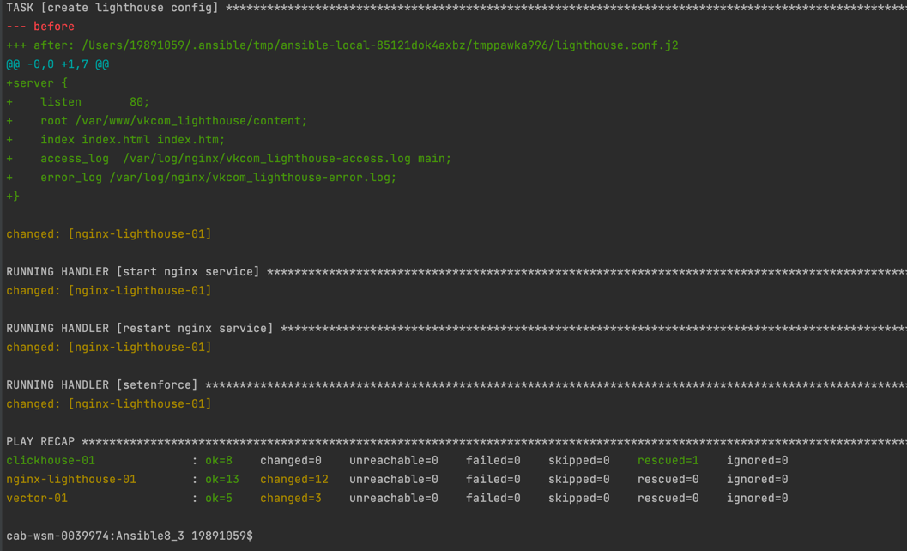

# Домашнее задание к занятию "8.3 «Использование Ansible»"

## Project Install Clickhouse and Veсtor and lighthouse Ansible-Playbook

## Installation
Установка производится на 3 ВМ yandex.cloud с предустановленной ОС Centos7

## Prerequisite
Ansible 2.10

## Особенности
Плейбук позволяет отправить логи nginx c лайтхауса с помощью вектора в кликхаус.  

Просмотр databases в кликхаус:  
```
clickhouse-01.ru-central1.internal :) show databases;

SHOW DATABASES

Query id: d7288f15-aa94-46ab-b756-2a04f7938f54

┌─name───────────────┐
│ INFORMATION_SCHEMA │
│ default            │
│ information_schema │
│ logs               │
│ nginxdb            │
│ system             │
└────────────────────┘

```
# Команда для запуска:  
```
ansible-playbook -i inventory/prod.yml site.yml
```

## Примечание: playbook работает только с пакетным менеджером yum  

## Теги:  
- clickhouse  
- vector  
- lighthouse


